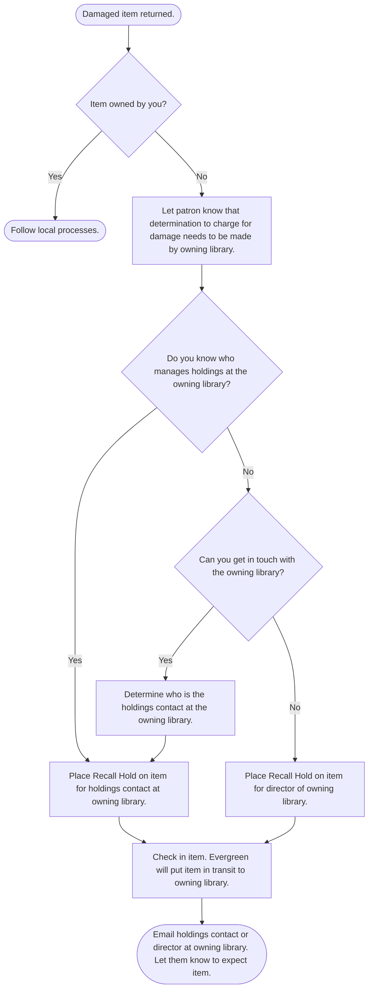

# Managing circulations

The **Items Out** list shows all current checkouts, lost items, and claims returned items on a patron’s account. Use this list to manage, update, and investigate patron loans.

The **Items Out** list includes three types of circulations on separate tabs:

- **Items Out**: Includes all currently checked out items
- **Other/Special Circulations**: Includes claims returned and lost items.
- **Non-Cataloged Circulations**: Includes circulations of non-cataloged items.

## Edit due dates

If an item checks out with the wrong due date, staff can change it:

1. Select the item.
2. Select **Actions &rarr; Edit Due Date**.
3. Set the correct date using the calendar widget.
4. Press **OK**.

:::note[OWWL Policy]

In some instances, mis-configured or conflicting settings will cause the item to be circulated with a loan period that is different than the checkout library's policy for the given type of material. In this case, the checkout library may edit the due date so that it follows their normal loan period.

:::

:::note[OWWL Policy]

In order to provide good customer service, library staff may edit the due date to provide extra time. The due date should not be extended beyond six weeks from the original due date without permission from the owning library. Do not use editing a due date to circumvent hold blocks, extend due dates on titles with holds, or prevent return of materials to the owning library.

:::

## Renewals

Most loans can be renewed, allowing additional loan periods. The number of renewals depends on the circulation library's circulation policies. Most libraries allow print books and audiobooks to be renewed twice. Videos usually allow one renewal. Special materials, such as new items, may not be renewable.

You can check renewal limits for a checked out item in the patron account under the **Items Out** list in the _Renewals Remaining_ column.

:::caution[Renewals may not be allowed if:]

- The item is not eligible for renewal.
- Another patron has placed a hold on the item.
- The maximum number of renewals has been reached.
- The patron’s library card is expired.
- The due date was manually changed after an attempted renewal.

:::

:::info

A renewal starts a new loan period from the renewal date. It does not extend the current loan.

:::

:::tip

Items can be renewed even if they are overdue and accruing fines. A renewal finalizes any overdue fines. If a patron is blocked from borrowing due to excessive fines or overdue items, they can still renew loans.

:::

### Autorenewals (automatic renewals)

Evergreen automatically tries to renew eligible items on their due date. This usually happens between 1:00 a.m. and 4:00 a.m., though there may be exceptions.

An autorenewal works like a patron manually renewing an item online. If a manual renewal would fail, the autorenewal will also fail.

Evergreen attempts an autorenewal only on the due date. If a renewal fails due to a hold, Evergreen will not try again, even if the hold is later filled.

:::note[OWWL Policy]

Per OWWL Policy, the number of autorenewals allowed is the same as the total number of renewals permitted.

:::

#### Notifications

If a patron has a valid email address on file, they will receive an email after an autorenewal attempt. The email will show which items renewed successfully and which did not. If multiple items are due on the same day, the patron will receive one email listing all renewal attempts.

#### Troubleshooting autorenewals

- Use the Autorenewal Checker Report to find out why an item didn’t autorenew.
- You can check whether a patron’s checked-out item was automatically renewed:
    1. Open the patron’s account and view their **Items Out**.
    2. Make sure the **Auto Renewal** column is visible.
        - If marked _Yes_, the last renewal was automatic.
        - If marked _No_, the last circulation was not an autorenewal. A _No_ does not mean the item cannot be autorenewed, only that it wasn't autorenewed.

### Staff renewals

There are several screens on which a staff member may renew a patron's items out.

#### Renew items

The **Renew Items** function allows staff to renew a loaned item by scanning its barcode. Staff can:

1. Select **Circulation &rarr; Renew Items**.
2. If needed, set a specific due date.
3. Scan the item barcode(s).

#### Renewing from a patron's "Items Out" list

1. Retrieve the patron’s account.
2. Select the **Items Out** tab.
3. Select the items to renew if only renewing specific loans.
4. Press **Actions** or right-click on an item's row in the table.
5. Choose one of the following:
   - **Renew**: Extends the loan for another standard period for the selected item(s).
   - **Renew All**: Renews all loans, even if not selected.
   - **Renew With Specific Due Date**: Sets a custom due date for the selected item(s). Set the due date in the renewal confirmation prompt.
6. Press **OK/Continue** or **Submit** in the confirmation prompt.
7. The list will update, moving renewed items to the bottom and reducing the _Renewals Remaining_ count for the item(s).

### Patron renewals

Patrons can renew their own loans by logging into their online accounts.

### Renewal errors

In addition to the renewal-specific errors mentioned below, some [checkout errors](./check-out.md#check-out-errors) could also be encountered when attemping a renewal.

###### ACTION_CIRCULATION_NOT_FOUND

This is an error message that indicates that the attempted action did not occur because the system cannot process the requested transaction. This error displays for both _Lost_ and _Claims Returned_ items.

###### COPY_NEEDED_FOR_HOLD

If another patron has placed a hold on the same title, the renewal fails.

:::note[OWWL Policy]

Per OWWL Policy, items with holds - title, volume, or copy level - cannot be renewed. The item must be checked in and routed to the next pending hold.

:::

###### MAX_RENEWALS_REACHED

This alert will display if an item has already been renewed the number of renewals allowed.

:::note[OWWL Policy]

Per OWWL Policy, avoid renewing items beyond the renewal limits. If the item belongs to another library, do not override the renewal limit without the permission of the owning library.

:::

## Overdue items

Overdue fines begin to accrue at 23:59 (11:59PM) the day after an item is due, and continue to accrue everyday at 23:59 until the item is checked in or until the item reaches the maximum fine amount or is marked lost.

Overdue fines are based on the circulation library's circulation policies and may vary according to the item's circulation modifier. Overdue fines do not accrue for any days that the library is closed.

Each day's fine is billed as an individual bill on the full billing transaction.

## Lost items

An item is considered lost if it is checked out to a patron and either:
- The patron reports it as lost, and staff use the **[Mark Lost By Patron](#mark-items-lost)** function to change the item's status to _Lost_.
- The item is overdue by more than four weeks, triggering the system to automatically change the status to _Lost_.

When an item is marked lost, Evergreen automatically bills the replacement cost of the item and any processing fees, if applicable.

### Mark item lost

Items can only be marked lost if they are currently checked out, and can only be manually marked lost from the patron's _Items Out_ list.

1. Retrieve the patron’s account.
2. Select the **Items Out** tab.
3. Select the item that you would like to mark lost and select **Actions &rarr; Mark Lost (By Patron)**
4. The circulation will be moved to the _Other/Special Circulations_ tab and the replacement cost will be billed to the patron account

:::note[OWWL Policy]

Per OWWL Policy, any library can mark an item lost, even items not owned by that library. Marking an item lost will create a Lost Materials bill on the patron's account, which will typically block the patron from further circulation. Generally, it is recommended that if there is any doubt whether the item is actually lost, libraries should renew the item (within remaining renewal limits and respecting hold blocks) and allow the item to become overdue until lost.

:::

### Lost items in the patron's record

Lost items have a status of _Lost_, but they remain in the patron’s **Other/Special Circulations** list until the circulation is resolved. The circulation is considered finished when:
- The item is found, checked in, and the overdue bill is paid, if applicable.
- The **Lost Materials** bill is paid or forgiven in full.

#### Lost item bills

Lost item bills:
- Are automatically generated when an item is marked lost.
- Are linked to the item in **Other/Special Circulations**.
- Must be fully paid or forgiven before the circulation is cleared.

Once a lost materials bill is fully paid or forgiven, the item’s status changes to _Lost and Paid_.

### Lost items at checkin

If a lost item is found, returned, and checked in, you will see a _COPY_STATUS_LOST_ alert.

## Damaged items

Marking an item as damaged changes the item's status to _Damaged_ and optionally allows you to bill a patron for the damage.

### Mark item damaged

You can mark an item damaged from a number of different screens, including the _Item Status_ screen, the _Holdings View_ tab on a bibliographic record, and the _Checkin Items_ screen.

1. Scan an item in _Item Status_ or select the _Detail View_ and select **Actions &rarr; Mark/Item as Damaged**; from _Holdings View_, select the item then select **Actions &rarr; Mark/Mark Item Damaged**; or from _Checkin Items_, select the item and select **Actions &rarr; Mark Items Damaged**.
2. Review the information and press **Submit** to confirm the action.
3. In the _Mark Item(s) Damaged_ dialog, decide whether you will charge the patron for damage.
   - If you will charge for damage:
      1. Select **Charge Fees** if it is not selected already.
      2. Keep the default replacement fee or enter a new amount.
      3. Select **Manual Damaged Item** as the bill type.
      4. Add a note (optional).
   - If you will not charge for damage:
      1. Press **No Charge** if it is now selected already.
4. Press **Submit**.

:::note[OWWL Policy]

Per OWWL Policy, if a damaged item is not owned by your library, use a Recall Hold to send the item back to the owning library for evaluation and to be marked damaged as necessary. Please follow the Damaged Item Flowchart to determine whether to mark an item damaged.

:::

#### Damaged item flowchart

## Claims returned

If a patron claims that they returned the item and neither they nor the library can find the item, you can mark the item as claims returned.

Marking an item as claims returned:
- Moves the item to **Other/Special Circulations**
- Changes the item status to _Claimed Returned_
- Increases the **Claims-returned Count** on the patron’s record

### Mark item claims returned

To mark an item as claims returned:

1. Select the item from the patron's **Items Out**.
2. Select **Actions &rarr; Mark Claims Returned**.
3. Select the date on which the patron claims they returned the item. If applicable, overdue fines will be adjusted as if the item had been returned on the date selected.
4. Press **Submit**.

## Claims never checked out

If a patron claims that they returned the item and neither they nor the library can find the item, you can mark the item as claims never checked out.

Marking an item as claims never checked out:
- Closes the circulation transaction
- Removes the item from the patron’s record
- Changes the item status to _Missing_
- Increases the **Claims Never Checked Out Count** on the patron's record

### Mark item claims never checked out

To mark an item as claims never checked out:

1. Select the item from the patron's **Items Out**.
2. Select **Actions &rarr; Mark Claims Never Checked Out**.
3. Press **OK/Continue**.

## Other functions

### Check in

In most cases, you will check in items using the [Checkin Items screen](./check-in.md). Use **Check In** from the **Items Out** list to remove an item from a patron’s record if it cannot be scanned.

1. Select the item.
2. Select **Actions &rarr; Check In**.
3. Press **OK/Continue**.

### Add billing

Use **Add Billing** to manually add a bill to a circulation transaction. This links the bill to the item’s title, circulation date, and other details.

A similar **Add Billing** function is available in the **Bills** section for adding manual charges to existing bills.

1. Select the item.
2. Select **Actions &rarr; Add Billing**.
3. Select the **Billing Type**.
4. Enter the **Amount** to bill.
5. Enter a **Note** if applicable.
6. Press **Submit Bill**.

### Print item receipt

To print due date slips for items already checked out:

1. Select the items.
2. Select **Actions &rarr; Print Item Receipt**.

### Circulation events

You can view any events associated with a circulation, such as courtesy notices, by viewing the circulation's **Triggered Event Log**.

1. Select the item.
2. Select **Actions &rarr; Show Triggered Events**.